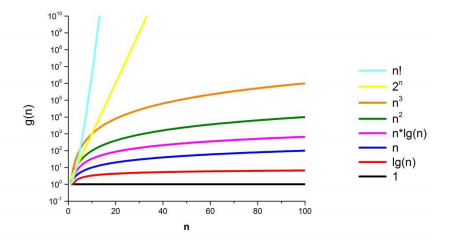

# The recap:

## Cechy algorytmów 
 - skończoność 
 - określoność 
 - wejście 
 - wyjście 
 - efektywność 
 - poprawność 

## Metody przedstawiania algorytmów 
 - Opis słowny 
 - Lista kroków 
 - Schemat blokowy 
 - Drzewa algorytmiczne 
 - Język programowania / pseudokod / python 

## Schemat blokowy 
 |**skrzynka** | **kształt**| 
 |:---:|:---:|
 |operacyjna | prostokąt|
 |warunkowa | rąb |
 |wejścia wyjścia | równoległobok |  
 |graniczna| owal |
 | ---| ---|
 |komentarza| zwykły napis |
 |łącznikowa| strzałka chyba | 

 ## Niezmiennik pętli:
 to zdanie które jest prawdziwe po każdym przebiegu pętli. 

## Notacja O 

## Porównanie wykresów złożoności
 

## Metody 
 - Zachłanna 
 - dziel i zwyciężaj 
 - dynamiczna 
 - zstępująca i wstępująca  

# Grafy 

## Rząd grafu 
  liczba wierzchołków grafu

## Rozmiar grafu 
 liczba krawędzi grafu

## Krawędź incydentna 
łączy dwa wierzchołki 

## Sąsiad 
dwa wierzchołki są sąsiadami, jeśli istnieje krawędź pomiędzy nimi

## Pętla własna 
krawędź łącząca wierzchołek z samym sobą

##Stopień wierzchołka
- w grafie nieskierowanym - liczba jego sąsiadów
- w grafie skierowanym - rozróżniamy stopień wejściowy (liczbę krawędzi, dla których dany wierzchołek jest pierwszym w parze) i wyjściowy (liczbę krawędzi, dla których dany wierzchołek jest drugim w parze)

## Podgraf grafu G 
graf, którego wierzchołki stanowią podzbiór zbioru wierzchołków G (nadgrafu) , a krawędzie podzbiór zbioru krawędzi G zawierający wszystkie krawędzie incydentne do podzbioru wierzchołków

## Graf pełny 
graf, którego każdy wierzchołek jest połączony krawędzią z każdym innym (Kn)

## Klika 
pełny podgraf grafu

## Acentryczność wierzchołka 
maksymalna z odległości tego wierzchołka do innych wierzchołków grafu

## Promień grafu 
najmniejsza acentryczność wierzchołka wśród wszystkich wierzchołków grafu

##  Średnica grafu 
największa acentryczność wierzchołka wśród wszystkich wierzchołków grafu.

## skierowany 
 - krawędzie są kierunkowe  