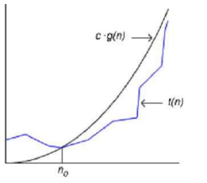

# Złożoność
Notacja przedstawiająca asymptotyczne tempo wzrostu

Czyli chodzi o zapis "jaką złożoność posiada dany algorytm".

## Rozróżniamy 
 - O(1) – złożoność stała 
 - O(log(n)) – złożoność logarytmiczna 
 - O(n) – złożoność liniowa 
 - O(nlog(n)) – złożoność liniowo-logarytmiczna 
 - O(n^2) – złożoność kwadratowa 
 - O(n^k), gdzie k jest stałą – złożoność wielomianowa 
 - O(k^n), gdzie k jest stałą – złożoność wykładnicza 
 - O(n!) – złożoność rzędu silnia 

Notacja **dużego O** określa asymptotyczne ograniczenie górne
 Algorytm posiada złożoność co najwyżej g(n). 

 

g(n) dla każdego x > n0 jest większe od f(n)

Notacja **Ω** określa asymptotyczne ograniczenie dolne 
 Algorytm posiada złożoność co najmniej g(n). 

g(n) dla każdego x > n0 jest mniejsze od f(n)

Notacja **Θ** funkcja f(x) jest rzędu dokładnie g(x) 

Notacja **małe o** funkcja f(x) jest niższego rzędu g(x)

różnica między dużym O jest taka że 
- w przypadku dużego O, każde f(x)  jest <= g(x) 
- dla małego o każde f(x)  jest < g(x)  

podobnie jest z  
Notacja **ω** funkcja f(x) jest wyższego  rzędu g(x)

różnica między  Ω jest taka że 
- w przypadku  Ω, każde f(x)  jest >= g(x) 
- dla ω każde f(x)  jest > g(x) 

